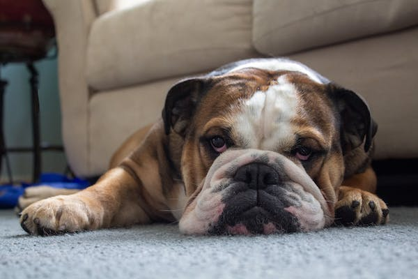

# compulist
<html>
  <head>
    <title>Razas de perros</title>
    
  </head>
  <body>
    <h1>Lista de 20 razas de perros con imágenes</h1>
    <ul>
      <li>
        
        <h2>Pitbull</h2>
      </li>
      <li>
        
        <h2>Bichon Frise</h2>
      </li>
      <li>
        
        <h2>Dálmata</h2>
      </li>
      <li>
        
        <h2>Bulldog Inglés</h2>
      </li>
      <li>
        
        <h2>Husky Siberiano</h2>
      </li>
      <li>
        
        <h2>Chow Chow</h2>
      </li>
      <li>
        
        <h2>Corgi</h2>
      </li>
    <li>
        
        <h2>Labrador</h2>
      </li>
       <li>
        
        <h2>Gran Danes</h2>
      </li>
       <li>
        
        <h2>Labrador</h2>
      </li>
      <li>
        
        <h2>Rottweiler</h2>
      </li>
       <li>
        
        <h2>Schnauzer</h2>
      </li>
      
    </li>
       <li>
        
        <h2>Bichon Frise</h2>
      </li>
      
      
